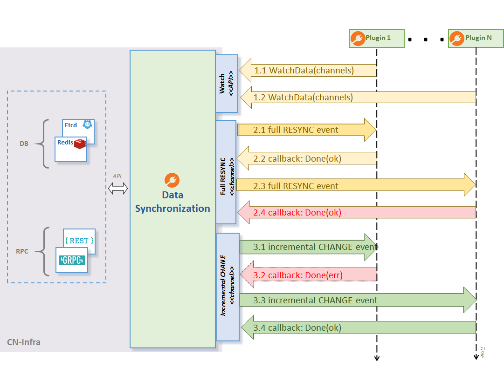
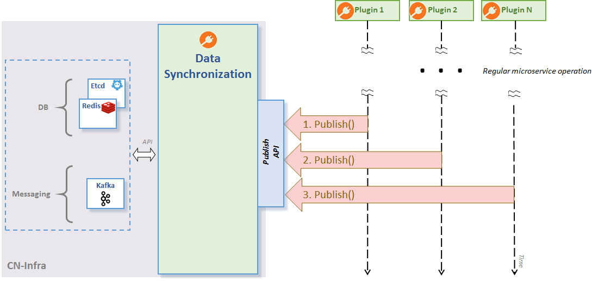

# Concept
Package datasync defines the interfaces for the abstraction [datasync_api.go](datasync_api.go)
of  a data synchronization between app plugins and different backend data sources 
(such as data stores, message buses, or RPC-connected clients).

In this context, data synchronization is about multiple data sets 
that need to be synchronized whenever a particular event is published. 
The event can be published by:
- database (when particular data was changed); 
- by message bus (such as consuming messages from Kafka topics); 
- or by RPC clients (when GRPC or REST service call ).

The data synchronization APIs are centered around watching 
and publishing data change events. These events are processed asynchronously.

The data handled by one plugin can have references to the data of another plugin. 
Therefore, proper time/order of data resynchronization between plugins needs to be maintained. The datasync plugin
initiates full data resync in the same order as the other plugins have been registered in Init().
  
## Watch data API
Watch data API is used by app plugin (see following diagram and the [example](../examples/datasync_plugin)) to:
1. Subscribe channels for particular data changes `Watch()` 
while being abstracted from a particular message source (data store, message bus or RPC)
2. Process Full Data RESYNC (startup, for certain fault recovery) event reprocess whole data set.
   Feedback is given to the user of this API (e.g. successful configuration or an error) by callback.
3. Process Incremental Data CHANGE. It is Optimized mode that 
   works only with a minimal set of changes (deltas).
   Again, feedback to the API's user (e.g. successful configuration or an error) is given by callback.

This APIs defines two types of events that a plugin must be able to process:
1. Full Data RESYNC (resynchronization) event is defined to trigger
   resynchronization of the whole configuration. This event is used
   after agent start/restart, or for fault recovery (when agent's connectivity to an
   external data source is lost and restored).
2. Incremental Data CHANGE event is defined to trigger incremental processing of
   configuration changes. Data change events are sent after the data
   resync has completed. Each data change event contains both the
   previous and the new/current values for the data. The Data synchronization 
   is switched to optimized mode after successful Full Data RESYNC. 

## Publish data API

Publish data API is used by app plugins to asynchronously publish events 
with particular data change values and still abstract from data store, message bus, local/RPC client.

