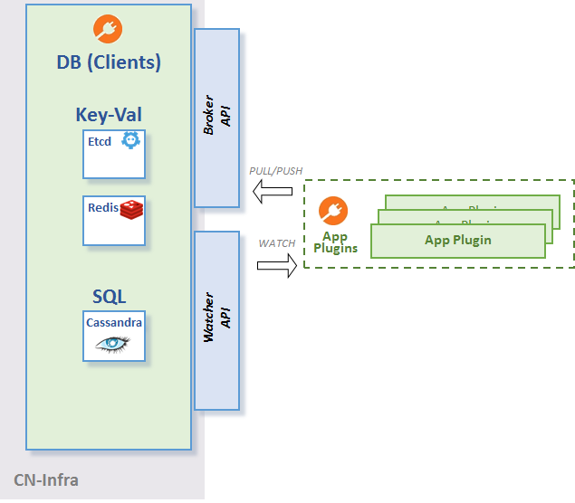

# The Data Broker (DB) abstraction
The CN-Infra Data Broker abstraction (see the diagram below) is based on
two APIs: 
* **The Broker API** - used by app plugins to PULL (i.e. retrieve) data
  from a data store or PUSH (i.e. write) data into the data store.  Data
  can be retrieved for a specific key or by running a query. Data can be 
  written for a specific key. Multiple writes can be executed in a 
  transaction.
* **The Watcher API** - used by app plugins to WATCH data on a specified 
  key; Watching means to monitor data changes on and be notified as soon 
  as the change occurs.

The Broker & Watcher APIs abstract common database operations implemented 
by different databases (ETCD, Redis, Cassandra). Still, there are major 
differences between [keyval](keyval)-based & [sql](sql)-based databases.
Therefore the Broker & Watcher Go interfaces are defined in each package 
separately; while the method names for a given operation are the same, 
the method arguments are different.

