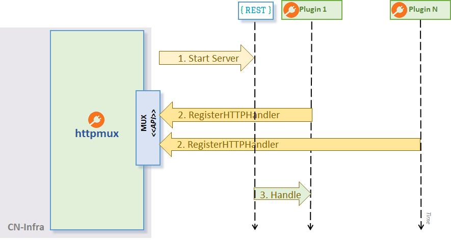

# HTTPmux

The `REST Plugin` is a infrastructure Plugin which allows app plugins 
to handle HTTP requests (see the following diagram) in this sequence:
1. httpmux starts the HTTP server in its own goroutine
2. Plugins register their handlers with `REST Plugin`. To service HTTP requests, 
   a plugin must first implement a handler function and register it at a
   given URL path using the `RegisterHTTPHandler` method. `REST Plugin` uses 
   an  an HTTP request  multiplexer from the `gorilla/mux` package to 
   register the HTTP handlers by the specified URL path. 
3. HTPP server routes HTTP requests to their respective registered handlers 
   using the `gorilla/mux` multiplexer.



**Configuration**

- the server's port can be defined using commandline flag `http-port` or 
  the environment variable HTTP_PORT.

**Example**

The following example demonstrates the usage of the `REST Plugin` plugin API:
```
// httpExampleHandler returns a very simple HTTP request handler.
func httpExampleHandler(formatter *render.Render) http.HandlerFunc {

    // An example HTTP request handler which prints out attributes of 
    // a trivial Go structure in JSON format.
    return func(w http.ResponseWriter, req *http.Request) {
        formatter.JSON(w, http.StatusOK, struct{ Example string }{"This is an example"})
    }
}

// Register our HTTP request handler as a GET method serving at 
// the URL path "/example".
httpmux.RegisterHTTPHandler("/example", httpExampleHandler, "GET")
```

Once the handler is registered with `REST Plugin` and the agent is running, 
you can use `curl` to verify that it is operating properly:
```
$ curl -X GET http://localhost:9191/example
{
  "Example": "This is an example"
}
```
